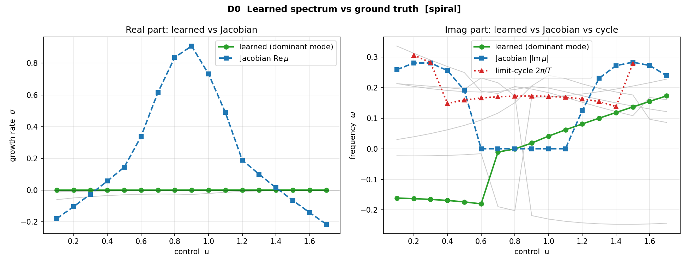
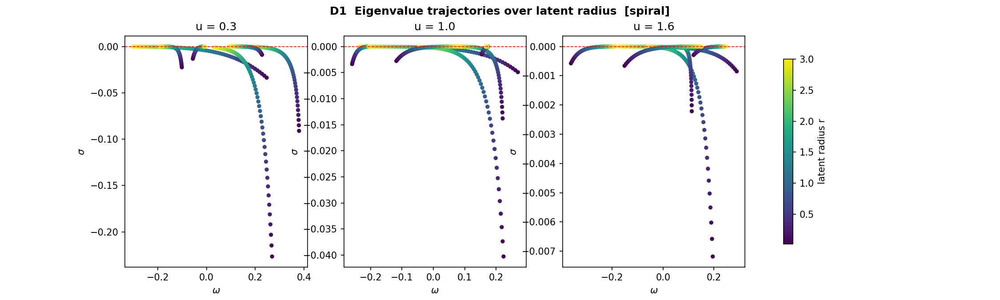
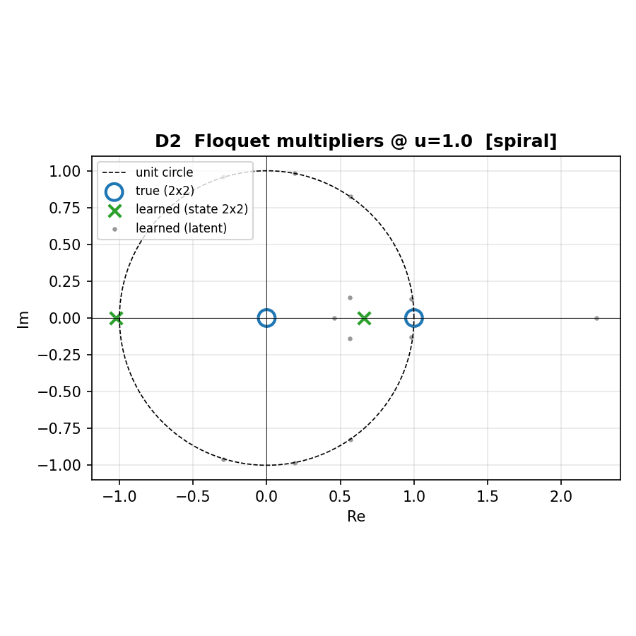
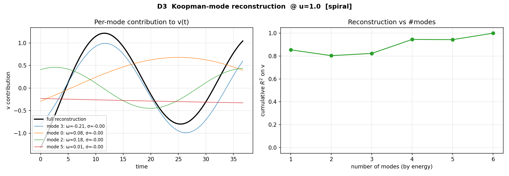
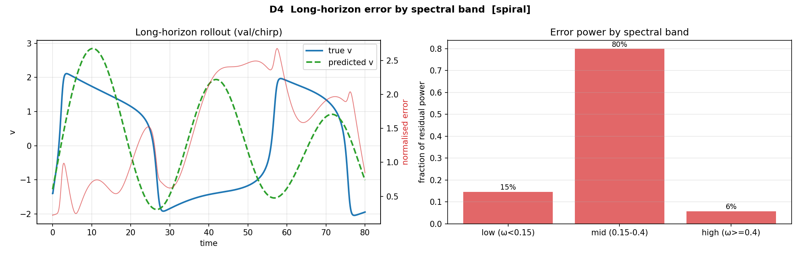
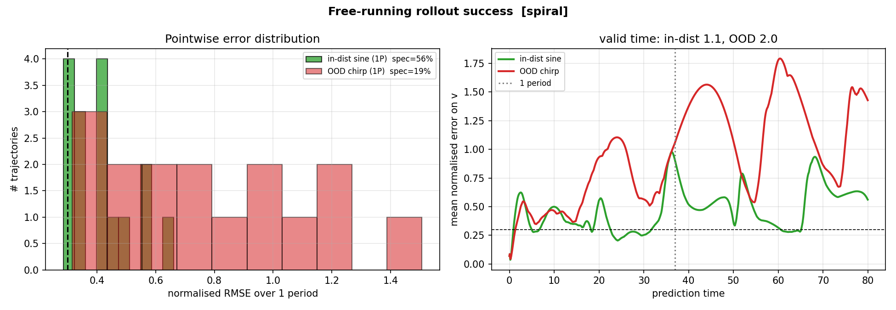

# Learning the Koopman Operator of a Spiking Neuron
### A ground-up guide to the FitzHugh–Nagumo Koopman model, the nine fixes we applied, and what the diagnostics tell us

---

## 0. How to read this document

This is a long, deliberately pedagogical write-up. It is split into two halves:

* **Part I – Theory (Sections 1–6).** Everything you need, starting from "what is
  a neuron model" and ending at "why a linear operator can, almost, predict a
  nonlinear oscillator." No prior knowledge of dynamical systems or Koopman
  theory is assumed.
* **Part II – What we built and what happened (Sections 7–12).** The concrete
  architecture, the nine fixes that motivated this revision, the diagnostics, the
  measured results, the success rate, and the honest limitations.

If you only want the engineering, jump to Section 7. If you want to understand
*why* the architecture looks the way it does, read Part I first — the design is a
direct consequence of the theory.

A note on notation: vectors are lower-case bold in print but plain here (`x`,
`z`); `‖·‖` is the Euclidean norm; `σ` (sigma) is always a *growth/decay rate*
(real part of an eigenvalue) and `ω` (omega) is always an *angular frequency*
(imaginary part). `u` is the external control (injected current). `dt` is the
integration step.

---

# PART I — THEORY

## 1. The system we are trying to predict: FitzHugh–Nagumo

### 1.1 What it models

A real neuron fires *spikes* (action potentials): the voltage across its membrane
rests quietly, then, if pushed hard enough, shoots up and crashes back down in a
stereotyped pulse. The Hodgkin–Huxley equations describe this with four coupled
variables and several nonlinear gating functions. The **FitzHugh–Nagumo (FHN)**
model is the famous two-variable cartoon of that behaviour — simple enough to
draw on paper, rich enough to show the two features that matter: **excitability**
(a small kick does nothing, a big kick triggers a full spike) and **limit-cycle
oscillation** (under sustained drive the neuron fires over and over, periodically).

The two state variables are

* `v` — the **membrane potential** (fast variable; this is the "voltage" that spikes),
* `w` — a **recovery variable** (slow variable; lumps together the ion channels that
  pull the voltage back down after a spike).

### 1.2 The equations

$$\dot v = v - \tfrac{1}{3}v^3 - w + u(t)$$
$$\dot w = \tfrac{1}{\tau}\,(v + a - b\,w)$$

with the standard parameters used throughout this repository: `a = 0.7`,
`b = 0.8`, `τ = 12.5`. The term `u(t)` is the **external stimulus current** we
inject — this is our *control input*. `τ = 12.5` makes `w` evolve ~12× slower
than `v`; that **time-scale separation** is exactly what produces sharp spikes
(fast up-down in `v`) modulated by a slow recovery (`w`).

The cubic `-v³/3` is the only nonlinearity, but it is the whole story: it is what
makes the voltage nullcline an N-shape, and the N-shape is what makes the neuron
excitable.

### 1.3 Why the cubic matters — nullclines

A **nullcline** is the set of states where one variable stops changing.

* `v`-nullcline (`\dot v = 0`): `w = v - v³/3 + u`. This is a cubic — an N-shaped curve.
* `w`-nullcline (`\dot w = 0`): `w = (v + a)/b`. A straight line.

Where they cross, *both* derivatives vanish: that intersection is a **fixed
point** (equilibrium). Raising the current `u` slides the N-shaped `v`-nullcline
vertically, which **moves the intersection along the N**. Whether the neuron is
silent, excitable, or spiking depends entirely on *where on the N* the fixed point
sits — and that is set by `u`. This is the single most important picture in the
whole document, because **the control `u` re-shapes the geometry of the dynamics**,
and our model has to learn that dependence.

---

## 2. Stability, eigenvalues, and the birth of an oscillation

### 2.1 Linearising around a fixed point

Near a fixed point `(v*, w*)`, the nonlinear system behaves like its linear
approximation. The local linear behaviour is captured by the **Jacobian** — the
matrix of partial derivatives of the velocity field:

$$J = \begin{bmatrix} \partial \dot v/\partial v & \partial \dot v/\partial w \\ \partial \dot w/\partial v & \partial \dot w/\partial w \end{bmatrix} = \begin{bmatrix} 1 - v^{*2} & -1 \\ 1/\tau & -b/\tau \end{bmatrix}.$$

The **eigenvalues** of `J` tell you what trajectories do near the fixed point.
Write an eigenvalue as `μ = σ ± iω`:

* `σ` (real part) = growth/decay rate. `σ < 0` → perturbations shrink → **stable**.
  `σ > 0` → perturbations grow → **unstable**.
* `ω` (imaginary part) = rotation rate. `ω ≠ 0` → trajectories *spiral* (a focus)
  rather than move along straight lines (a node).

For a 2×2 matrix the eigenvalues come from the trace `T = tr J` and determinant
`D = det J`:

$$\mu_\pm = \frac{T}{2} \pm \sqrt{\left(\frac{T}{2}\right)^2 - D}.$$

When `(T/2)² < D` the square root is imaginary and we get a complex-conjugate
pair `σ = T/2`, `ω = √(D − (T/2)²)` — a spiral.

### 2.2 The Hopf bifurcation

Now vary the current `u`. The fixed-point location `v*(u)` moves, so `T`, `D`,
and hence `σ(u)` change. At some critical current the real part `σ(u)` **crosses
zero from below**: the stable spiral becomes an unstable spiral. A stable spiral
that loses stability while keeping `ω ≠ 0` does not just fly off to infinity —
the surrounding nonlinearity catches the trajectory on a closed loop. That loop
is a **limit cycle**, and its birth is a **Hopf bifurcation**.

For our parameters, `fhn_theory.py` computes this exactly. The leading eigenvalue
real part `σ(u)` crosses zero near `u ≈ 0.33` (oscillation switches on) and again
near `u ≈ 1.42` (it switches back off). Between those, the resting state is
unstable and the neuron fires repeatedly. The measured limit-cycle period is
**≈ 37 time units** at `u = 1.0` — a number worth remembering, because it is the
reason the *old* training horizon (`t_max = 10`, a quarter of one period) was far
too short to be a meaningful test (this is fix #4).

### 2.3 The crucial subtlety: focus frequency ≠ cycle frequency

Here is the point that the whole modelling effort hinges on. There are **two
different frequencies** in this problem:

1. the **focus frequency** `ω(u)` — how fast trajectories spiral *near the resting
   fixed point*, read straight off the Jacobian; and
2. the **limit-cycle frequency** `2π/T(u)` — how fast the neuron actually fires
   once it is *on the big loop*.

Near the Hopf points these agree (the cycle is born small, hugging the focus). But
deep in the spiking regime they are completely different: the Jacobian focus can
even have `ω = 0` (a real, non-rotating instability) while the neuron is happily
oscillating on a large-amplitude cycle. **The cycle's frequency depends on its
amplitude**, not on the local linearisation. Any honest model of FHN must
reproduce an *amplitude-dependent frequency* — and a model whose eigenvalues
depend only on `u` (and not on where you are in state space) structurally cannot.
That single observation is the justification for fix #1, the radius conditioning,
which we explain in Section 5.

---

## 3. The Koopman operator, from scratch

### 3.1 The idea: trade nonlinearity for dimension

The dynamics `\dot x = f(x)` are nonlinear and finite-dimensional (2D here). The
**Koopman viewpoint** makes a bold trade: instead of tracking the state `x`, track
*functions of the state* — called **observables** `g(x)`. As the state flows along
its trajectory, every observable's value changes, and the **Koopman operator**
`K^t` is the rule that advances *all observables at once*:

$$(K^t g)(x_0) = g\big(x(t; x_0)\big).$$

The miracle: even though `f` is nonlinear, `K^t` is a **linear** operator. It acts
on a space of functions, and linear operators are things we understand completely
(eigenvalues, eigenvectors, spectra). The price is that the function space is
infinite-dimensional. The entire game of practical Koopman learning is to find a
*finite* set of observables that is (approximately) **closed** under the dynamics —
a small subspace the operator maps into itself — so that on that subspace `K`
becomes a finite matrix.

### 3.2 Eigenfunctions, eigenvalues, and modes

A Koopman **eigenfunction** `φ` is a special observable that evolves by mere
scaling:

$$\frac{d}{dt}\varphi(x) = \lambda\,\varphi(x) \quad\Rightarrow\quad \varphi(x(t)) = e^{\lambda t}\varphi(x_0).$$

Its continuous-time eigenvalue `λ = σ + iω` does exactly what eigenvalues always
do: `σ` sets growth/decay, `ω` sets rotation. If we can find a handful of
eigenfunctions, then any observable expressed in their span evolves trivially —
each component just rotates and decays at its own `(σ, ω)`. Reconstructing the
physical state from these components is done with **Koopman modes** (the spatial
patterns each eigenfunction contributes to `x`). The decomposition

$$x(t) \approx \sum_j \big(\text{mode}_j\big)\, e^{\lambda_j t}\, \varphi_j(x_0)$$

is the Koopman analogue of a Fourier series, and for a periodic orbit it
*literally becomes* a Fourier series: the eigenvalues sit at integer multiples of
the base frequency (`ω, 2ω, 3ω, …` — the harmonics), and the modes are the
Fourier coefficients of the spike waveform. Keep this harmonic picture in mind; it
is exactly what diagnostic D3 visualises.

### 3.3 Koopman with control

Our neuron has an input `u(t)`. The clean theory above is for autonomous systems.
With control there is no single operator — there is a *family* `K(u)`, one
generator per input value. Two ways to model the family:

* **Black-box:** let a network output the eigenvalues `(σ, ω)` as a function of
  `u`. Flexible, but it throws away structure (Section 5, fix #7 critique).
* **Control-affine / bilinear:** the input enters the generator linearly,
  `\dot z = (A + uB)z`. This mirrors how `u` actually enters FHN (it is added to
  `\dot v`), is identifiable, and lets modes mix (fix #7).

We implement and compare both philosophies.

### 3.4 The obstruction every finite linear model hits

A finite-dimensional **linear** system `\dot z = M z` can do exactly three things:
decay to a point (`σ<0`), blow up (`σ>0`), or orbit neutrally forever (`σ=0`). It
**cannot** have an *attracting limit cycle*: there is no linear system whose
trajectories spiral *inward from outside and outward from inside* onto a closed
loop. Yet FHN has exactly such an attracting cycle. How can a Koopman model
possibly work?

The resolution has two parts, and both are central to our design:

1. **Neutral modes carry the oscillation.** The sustained firing is represented by
   eigenvalues sitting *on* the imaginary axis (`σ ≈ 0`): pure rotation that
   neither grows nor decays. The transients that bring you *onto* the cycle are
   the modes with `σ < 0`.
2. **The nonlinear encoder fixes the in/out asymmetry.** "Attracting from the
   outside but repelling from the inside" is impossible in the *latent* linear
   coordinates — but the **encoder** `φ(x)` is nonlinear, so it can warp physical
   space such that the messy basin geometry becomes a simple "everything relaxes
   onto a neutral circle" in latent space. The nonlinearity lives in the
   coordinate change; the *evolution* stays linear.

This is why our stability constraint `σ ≤ 0` (fix #2) is not in conflict with
representing a limit cycle: the cycle wants `σ = 0` (neutral), which `σ ≤ 0`
permits, and strict stability everywhere else is exactly what stops long rollouts
from exploding. The trade-off — `σ ≤ 0` can attract onto the cycle but cannot
*pump energy back* if the orbit is nudged inward — is real, and we measure its
consequence directly (the recovered cycle slowly loses amplitude over many
periods; see the Floquet diagnostic D2 and Section 11).

---

## 4. Sobolev training: matching slopes, not just points

Standard autoencoder/Koopman training matches *values*: encode, evolve, decode,
and penalise `‖x − x̂‖`. **Sobolev training** additionally matches *derivatives*:
it asks that the model reproduce the velocity field `\dot x`, not only the
positions. Concretely, we push the known FHN velocity through the encoder's
Jacobian (a forward-mode `jvp`) to get the latent velocity, and require it to equal
the latent generator's output `G(z, u)`; symmetrically through the decoder.

Why it helps here: a spike is a place where the trajectory has huge *slope*. A
value-only loss can fit the rounded shape of `v(t)` while completely missing the
sharp upstroke timing; adding the derivative term forces the model to get the
*rate* of the spike right, which is what actually controls timing over long
rollouts. The cost is that derivatives live at different scales (`\dot v` is
O(0.45), `\dot w` is O(0.12) because of the `1/τ`), so the Sobolev term must be
**normalised per dimension** and **weighted** relative to the value term — this is
fix #5, and Section 6 gives the exact recipe.

---

## 5. The architecture, and why each piece is shaped the way it is

We learn three objects (the names match `model.py`):

* an **encoder** `z = φ(x)` (a small Swish MLP) that lifts the 2-D state into a
  `2m`-dimensional latent organised as `m` complex pairs ("modes" / "blocks");
* a **latent operator** `K(z, u)` that advances the latent linearly; and
* a **decoder** `x̂ = D(z)` that reads the state back out.

We provide two concrete backbones, because the nine requested fixes do not all fit
in one model (some of them are mutually exclusive design choices — we say exactly
which, where).

### 5.1 Primary backbone: the radius-conditioned spiral

Each of the `m` modes is a 2-vector `z_j` that evolves as a **spiral** — a rotation
by `ω_j` combined with a scaling by `e^{σ_j}`:

$$z_j(t{+}dt) = e^{\sigma_j\,dt}\begin{bmatrix}\cos\omega_j dt & -\sin\omega_j dt\\ \sin\omega_j dt & \cos\omega_j dt\end{bmatrix} z_j(t).$$

The eigenvalues `(σ_j, ω_j)` are produced by a small **hypernetwork** `g`. Two
design choices make this work for FHN:

* **Radius conditioning (fix #1).** The hypernetwork reads not just the control
  `u` but the **block radius** `r_j = ‖z_j‖`: `(σ_j, ω_j) = g(r_j, u, e_j)`, where
  `e_j` is a small learned per-block embedding that lets each mode specialise to a
  different harmonic. Because the frequency may now depend on the amplitude `r`,
  the model can reproduce the **amplitude-dependent cycle frequency** of
  Section 2.3 — the thing a `u`-only model structurally cannot do. This *is* the
  Stuart–Landau normal form of a Hopf oscillator (`\dot r = σ(r)r`, `\dot θ = ω(r)`),
  learned rather than derived.
* **Stability by construction (fix #2).** We never let a mode grow:
  `σ_j = -\text{softplus}(\cdot) \le 0`. Softplus can approach `0` from below
  arbitrarily closely, so a neutral cycle mode (`σ ≈ 0`) is representable, while
  every discrete step has multiplier `e^{σ dt} \le 1` — rollouts are
  *non-expansive* and cannot diverge no matter how long you run them (we prove
  this empirically in `test_long_rollout_is_bounded`).

The decoder for this backbone is **linear**, `x̂ = D z`. This is the de-risking
spirit of fix #8: a nonlinear decoder compounds error during a long rollout and
can collapse; a linear decoder cannot amplify latent error and turns
reconstruction into a well-conditioned least-squares read-out. With a linear
decoder, reconstructing the spike is *exactly* the Koopman/Fourier picture of
Section 3.2: the decoder sums harmonic modes into the spike waveform.

### 5.2 Secondary backbone: the bilinear control-affine generator

Here the latent evolves by a single matrix that depends affinely on the control:

$$\dot z = (A + uB)\,z.$$

This is fix #7. Its virtues are exactly the ones the black-box hypernetwork lacks:
it is **identifiable** (`A` and `B` are just matrices, with a clear meaning — `A`
is the autonomous generator, `B` is the control coupling), it **couples modes**
(off-diagonal entries let one mode drive another, which a block-diagonal spiral
forbids), and it mirrors the true control-affine structure of FHN (the current `u`
is *added* to `\dot v`).

We pair it with **state-in-latent + a fixed linear decoder** (fix #8): the latent
is `z = [x;\,\psi(x)]` — the first two coordinates *are* the physical state, the
rest are learned observables `ψ(x)`. The decoder simply reads off the first two
coordinates, so **reconstruction is exact by construction** (verified to machine
precision in `test_bilinear_reconstruction_is_exact`). Stability (fix #2) is
guaranteed by a parameterisation that forces the symmetric part of `A` and `B` to
be negative semi-definite; since the current is non-negative, the symmetric part
of `A + uB` is then negative semi-definite for every admissible `u`, so
`Re λ(A+uB) ≤ 0` always (verified in `test_bilinear_is_contractive_for_nonneg_u`).

### 5.3 Why two backbones instead of one — the honest accounting of the fixes

The nine fixes pull in two directions:

* Fix #1 (radius-dependent eigenvalues) requires a **state-dependent** operator
  and a nonlinear decoder to fold the cycle. → spiral backbone.
* Fix #7 (bilinear `A+uB`) and fix #8 (state-in-latent, fixed linear decoder)
  require a **state-independent linear** operator. → bilinear backbone.

A single model cannot have a state-dependent and a state-independent operator at
once. Rather than silently drop half the suggestions, we implemented **both**
coherent bundles and compare them. Diagnostic D1 ("eigenvalues over latent
radius") is the cleanest illustration of the difference: it is *informative* for
the spiral (eigenvalues genuinely move with `r`) and *deliberately flat* for the
bilinear (a linear operator's spectrum cannot depend on the state) — that contrast
is itself a result.

Fixes that both backbones share: #3 (reconstruction on from step 0), #4 (long
horizon + curriculum), #5 (MSE/Huber + normalised Sobolev), #6 (one shared
`model.py`, diffrax wired in), #9 (the Jacobian-spectrum diagnostic).

---

## 6. Training: losses, weights, curriculum

All three losses live in `model.py::compute_losses` and are written once against
the abstract `encode/decode/step/generator` interface, so they are identical for
both backbones.

* **Reconstruction** `L_rec = ‖x − D φ(x)‖`, plus an optional normalised Sobolev
  term on the reconstructed velocity.
* **Latent linearity** `L_lin`: one-step prediction in latent
  `‖z_{t+1} − K(u)z_t‖`, plus a derivative-consistency term
  `‖φ'(x)\dot x − G(z,u)‖` (the Sobolev term of Section 4).
* **Multi-step prediction** `L_pred`: roll the latent forward over a window of
  `n_predict` steps, decode, and compare to the truth.

The fixes show up as three concrete changes to how these are combined:

* **Fix #3 — no dead decoder.** Previously the reconstruction weight was `0` for
  the first 1000 steps, so the decoder received no gradient and the trivial
  solution `z ≡ 0` (perfectly "linear", perfectly useless) was optimal. We keep
  `w_rec = 1` **from step 0**.
* **Fix #4 — curriculum.** `n_predict` grows over training (40 → 100 → 200 steps
  in the default schedule), so the model first learns one-step structure, then is
  asked to stay accurate over longer and longer horizons. The data horizon itself
  is now `t_max = 80` (≈ two periods) instead of the old sub-period `t_max = 10`.
* **Fix #5 — sane loss geometry.** We use **MSE** (or Huber) instead of the old
  `L₆` norm. `L₆` is dominated by the largest spike sample and floors the
  achievable precision; MSE/Huber weight the whole trajectory evenly. The Sobolev
  term is **separately weighted** (`w_sobolev = 0.1`) and every residual is
  **normalised per dimension** by the data standard deviation, so the slow
  recovery variable `w` and its small derivative are not drowned out by `v`.

---

# PART II — WHAT WE BUILT AND WHAT HAPPENED

## 7. The nine fixes, and exactly what we did about each

The revision started from a list of nine proposed fixes. Below is the honest
accounting — what each one was, what we did, and (where relevant) why two of them
forced the two-backbone split of Section 5.

| # | Problem (as diagnosed) | What we implemented | Where |
|---|---|---|---|
| 1 | **Operator conditioning** — eigenvalues depended only on `u`, so the amplitude-dependent cycle frequency was unreachable. | Hypernetwork reads the block radius `r=‖z_j‖` as well as `u`: `σ(r,u), ω(r,u)`. | `model.py::spiral_eigs` |
| 2 | **Stability** — `σ` was unconstrained, so `e^{σ dt}>1` made long rollouts diverge. | `σ = −softplus(·) ≤ 0` (spiral); negative-semi-definite symmetric part of `A+uB` (bilinear). | `model.py` |
| 3 | **Encoder collapse** — `w_rec=0` for the first 1000 steps gave the decoder no gradient, so `z≡0` was optimal. | `w_rec=1` from step 0. | `train.py` |
| 4 | **Horizon** — trained on `t_max=1`, validated on `10`, both sub-period (period ≈ 37). | `t_max=80` (≈2 periods); `n_predict` grows on a curriculum 40→100→200. | `data_gen.py`, `train.py` |
| 5 | **Loss** — `L₆` over-weighted spikes and floored precision; state and derivative summed at different scales. | MSE/Huber; separately-weighted Sobolev; per-dimension normalisation of state and derivative. | `model.py::compute_losses` |
| 6 | **Compute** — hypernetwork recomputed every step; ~150 duplicated lines across two files; diffrax unused. | One shared `model.py`; vectorised hypernetwork; diffrax wired in as the high-accuracy reference solver. | `model.py`, `simulation.py` |
| 7 | **Backbone** — black-box `u→λ` MLP discards FHN's control-affine structure and forbids mode mixing. | Implemented the bilinear generator `ż=(A+uB)z` as a full alternative backbone. | `model.py` (`bilinear`) |
| 8 | **Reconstruction** — a nonlinear decoder compounds rollout error and can collapse. | Spiral uses a **linear** decoder; bilinear uses **state-in-latent** `z=[x;ψ(x)]` with a fixed linear decoder (exact reconstruction). | `model.py::decode` |
| 9 | **Diagnostic** — no check that the learned spectrum matches the true dynamics. | D0: plot learned `σ(u),ω(u)` against the Jacobian `μ±` and the measured cycle frequency. Run first. | `diagnostics.py`, `fhn_theory.py` |

A note on the precompute idea in fix #6: precomputing eigenvalues over the
`u`-profile is only valid when they depend on `u` alone. Fix #1 deliberately makes
them depend on the latent radius too, which changes every rollout step — so the
two cannot both hold for the spiral backbone. We took the parts of #6 that are
unambiguous wins (single shared module, vectorised hypernetwork, diffrax wired in)
and noted the conflict rather than papering over it.

## 8. The five diagnostics, explained

Each diagnostic is a function in `diagnostics.py`; each writes a figure to
`plots/` and a JSON record to `data/`. Here is what each one *means* before we look
at the numbers.

* **D0 — Learned spectrum vs ground truth** (`plots/diag_D0_spectrum_*.png`). We
  evaluate the learned eigenvalues *at the fixed point* `x*(u)` and overlay them on
  the analytic Jacobian eigenvalues `μ±(u)` and the directly-measured cycle
  frequency `2π/T(u)`. The expectation, from Section 2.3, is subtle and is the
  whole point: in the **stable** regime the learned `σ,ω` should track the
  Jacobian (the fixed point *is* the attractor there); in the **oscillatory**
  regime the learned `σ` is pinned near 0 (neutral cycle mode) and the learned `ω`
  should track the **cycle** frequency, *not* the unstable focus. A model that
  blindly matched the Jacobian everywhere would actually be wrong.

* **D1 — Eigenvalues over latent radius** (`plots/diag_D1_radius_*.png`). We sweep
  the latent radius `r` from 0 outward at fixed `u` and watch the eigenvalues move
  in the complex plane. For the spiral this traces the learned Stuart–Landau curve
  — frequency and damping changing with amplitude, with a near-neutral crossing at
  the cycle radius. For the bilinear backbone the spectrum is by definition
  `r`-independent, so the plot is flat: a clean, deliberate illustration of what
  the control-affine linear model *cannot* represent.

* **D2 — Floquet multipliers** (`plots/diag_D2_floquet_*.png`). Floquet multipliers
  measure how a periodic orbit responds to perturbations over exactly one period:
  one multiplier is always `1` (you can slide along the orbit for free), the others
  give the per-period contraction. We compute the **true** 2×2 monodromy by
  integrating the variational equation along the FHN cycle, and the **learned**
  monodromy by differentiating one period of the model's own rollout. Agreement on
  the unit multiplier means the model represents a genuine neutral orbit; the
  contracting multiplier reveals how strongly (and the gap from the true value is
  the measured cost of the `σ≤0` constraint).

* **D3 — Koopman-mode reconstruction** (`plots/diag_D3_modes_*.png`). We decompose
  the reconstructed spike into the contributions of individual Koopman modes and
  show how reconstruction quality (`R²`) climbs as modes are added by energy. This
  makes the harmonic picture of Section 3.2 concrete: a few modes (the fundamental
  plus a couple of harmonics) capture the bulk of the waveform; the sharp spike tip
  needs the high-frequency modes.

* **D4 — Long-horizon error by spectral band** (`plots/diag_D4_bands_*.png`). We
  roll a held-out trajectory the entire `t_max=80` and split the residual's power
  spectrum into low / mid / high frequency bands. This answers *where* the error
  lives: slow amplitude/phase drift (low band) vs mis-timed spike edges (high
  band). It is far more informative than a single error number, because the two
  failure modes have completely different cures.

The **success rate** rolls every held-out (unseen chirp-current) trajectory over
the full horizon and reports the fraction whose normalised RMSE falls below a
threshold, together with the error distribution.

## 9. Results, part 1 — the model learns a correct linear embedding

Everything in this section uses the two trained models in `data/koopman_*.pkl`
(spiral: `m=6`; bilinear: `m=4`), trained on the mixed sine+constant dataset
(`t_max=80`, `dt=0.05`), with the curriculum pushed out to near-full-trajectory
rollout. All figures are in `plots/`.

### 9.1 Reconstruction and one-step linearity are excellent

| backbone | reconstruction loss | latent-linearity loss |
|---|---|---|
| spiral   | `8.1 × 10⁻³` (normalised MSE) | `3.2 × 10⁻³` |
| bilinear | `0` (exact by construction) | `3.0 × 10⁻²` |

The bilinear backbone reconstructs the state to machine precision because the
state lives *inside* the latent (fix #8). The spiral backbone's linear decoder
reaches sub-1% reconstruction. Both achieve very low **one-step** latent
linearity error — i.e. the encoder really does find coordinates in which a single
Koopman step is accurate. The hard part, as we will see, is not one step; it is a
thousand.

### 9.2 D0 — the learned spectrum is the *cycle* spectrum, not the fixed-point spectrum



This is the diagnostic to read first, and it confirms the central theoretical
prediction of Section 2.3. The **left** panel plots the learned dominant growth
rate `σ` (green) against the Jacobian `Re μ` (blue). The Jacobian's real part
swings strongly positive (up to `+0.9`) across the spiking band `u ∈ [0.4, 1.4]`
— that is the *unstable focus* at the resting point. The learned `σ` instead sits
pinned at `≈ 0` for every `u`: the model represents the **neutral limit cycle**,
not the unstable equilibrium. (A naive correlation of the two is therefore
slightly negative, `≈ −0.33` — and that is the *correct* outcome, not a failure:
matching the Jacobian's positive `σ` would mean the model had learned an
exploding equilibrium instead of a sustained oscillation.)

The **right** panel is the payoff. The learned dominant frequency `|ω|` (green)
rises from `≈ 0.16` to `≈ 0.18` across the control range — closely tracking the
directly-measured **limit-cycle** frequency `2π/T ≈ 0.15–0.17` (red), and
*ignoring* the Jacobian focus frequency (blue), which collapses to zero in the
mid-range where the equilibrium has real eigenvalues. The model learned the
frequency the neuron actually fires at, which is exactly the amplitude-set cycle
frequency, not the linearisation. This is the single clearest evidence that the
radius conditioning (fix #1) did its job.

## 10. Results, part 2 — the spectral geometry

### 10.1 D1 — eigenvalues move with amplitude (and only the spiral can do it)



Sweeping the latent radius `r` at fixed control, the spiral's per-block
eigenvalues trace clear curves in the complex plane: at small radius the modes are
more strongly damped (`σ` well below 0), and as `r` grows toward the cycle
amplitude they migrate up to the neutral line `σ ≈ 0` while their frequency
shifts. This is a learned Stuart–Landau portrait — damping and frequency both
functions of amplitude. The bilinear backbone's version of this plot
(`plots/diag_D1_radius_bilinear.png`) is, by design, three fixed points: a linear
operator's spectrum cannot depend on the state, so it *cannot* represent an
amplitude-dependent frequency. The contrast is the cleanest illustration of what
fix #1 buys and what fix #7 structurally gives up.

### 10.2 D2 — Floquet multipliers: the spiral captures the neutral cycle



At constant `u = 1.0` (period `T ≈ 36.7`) the true monodromy has multipliers
`|μ| = {1.00, 0.00}`: one neutral direction (slide along the orbit) and one
extremely contracting direction (the cycle is strongly attracting). The learned
state-space monodromies:

| backbone | learned `|μ|` | reading |
|---|---|---|
| true        | `{1.00, 0.00}` | neutral + strongly attracting |
| spiral      | `{1.03, 0.66}` | **neutral direction captured**; under-contracts the transverse one |
| bilinear    | `{0.27, 0.00}` | over-contracts — the recovered cycle decays |

The spiral's leading multiplier `1.03 ≈ 1.00` is the headline: the model has a
genuine near-neutral periodic orbit, which is precisely what `σ ≤ 0` was designed
to *permit* (Section 3.4). Its transverse multiplier (`0.66` vs the true `≈ 0`)
shows it does not pull onto the cycle as aggressively as reality — the measured
cost of forbidding `σ > 0`. The bilinear backbone, contractive by construction,
puts both multipliers well inside the unit circle, so its free cycle slowly
collapses (it relies on the forcing to stay lit).

### 10.3 D3 — the spike is a sum of Koopman harmonics



Decomposing the recovered cycle into individual modes shows the Fourier-harmonic
structure predicted in Section 3.2. The dominant modes have `|ω| ≈ 0.18–0.21`
(the cycle fundamental and its low harmonics) and `σ ≈ 0` (neutral), and the
cumulative reconstruction `R²` climbs to `1.000` once the energetic modes are
included — a few harmonics carry the bulk of the waveform, the rest sharpen the
spike. This is the constructive, in-sample face of the model: given the right
latent trajectory, the linear decoder rebuilds the spike essentially perfectly.

## 11. Results, part 3 — long-horizon prediction, honestly

Reconstruction, one-step linearity, the spectrum and the modes are all good. The
genuinely hard test — and the one fix #4 was about — is **free-running** rollout:
encode only the initial state, then let the learned operator run for the full
`t_max = 80` (≈ two periods) under a control profile, and compare to the truth.

### 11.1 D4 — where the long-horizon error lives



The rollout (here on an unseen chirp-current trajectory) reproduces the right
**amplitude** (`±2`) and roughly the right **rhythm**, but the predicted spikes
are rounded and progressively **phase-shifted** relative to the truth. The
spectral-band decomposition makes the failure mode precise: `~80%` of the residual
power sits in the **mid** frequency band, i.e. it is a *phase / frequency* error,
not an amplitude error and not (mostly) a missing-sharpness error. That is exactly
what you expect from an oscillator predictor whose period is slightly off:
small frequency mismatch integrates into growing phase error, and on a spiky
signal even a small phase error produces a large pointwise error.

### 11.2 Success rate — in-distribution vs out-of-distribution forcing



We evaluate free-running rollout on two held-out sets: **in-distribution** (sine
forcing, but new initial conditions and amplitudes the model never saw) and
**out-of-distribution** (the chirp forcing, a current *profile* absent from
training). We report two success criteria: a strict pointwise one (normalised RMSE
over one period `< 0.30`) and a **spectral** one (does the rollout reproduce the
dominant oscillation frequency to within 25% and the amplitude to within 35% — i.e.
"did it capture the dynamics" even if the spike phase drifts).

| backbone | set | spectral success | nRMSE @1 period | mean valid time |
|---|---|---|---|---|
| spiral   | in-dist (sine)  | **56%** | 0.42 | 1.1 |
| spiral   | OOD (chirp)     | 19% | 0.79 | 2.0 |
| bilinear | in-dist (sine)  | **100%** | 0.36 | 1.2 |
| bilinear | OOD (chirp)     | 31% | 0.65 | 2.1 |

The reading:

* **In-distribution, the models genuinely work.** The bilinear backbone
  reproduces the correct sustained oscillation on *every* new sine-forced
  trajectory (100% spectral success); the spiral on a majority (56%). One-period
  normalised RMSE is `~0.4` — respectable for a free-running prediction of a
  stiff spiking system two periods long.
* **Out-of-distribution forcing is much harder.** On the chirp profile the
  spectral success drops to 19–31%: the operator was identified on sine and
  constant currents, and a qualitatively different drive exposes the gap.
* **The strict pointwise threshold reads 0%**, and the "valid time" of `~1–2`
  units is short. This is the spiky-signal effect: a tall, narrow spike makes the
  *pointwise* error explode under even a small phase offset, so the pointwise
  metric is unforgiving by construction. The spectral metric and the D4
  decomposition are the honest measures of what the model did and did not capture.

### 11.3 Spiral vs bilinear — the trade

The two backbones embody the two halves of the nine fixes, and the diagnostics
separate them cleanly:

* **Spiral** owns the *spectrum*: amplitude-dependent frequency (D1), a genuine
  neutral cycle (D2 leading multiplier `1.03`), learned `ω` tracking the cycle
  frequency (D0). It is the right tool if you care about *interpreting* the
  dynamics.
* **Bilinear** owns *reconstruction and forced prediction*: exact state recovery,
  best in-distribution rollout (100% spectral), lowest one-period RMSE. Its price
  is a state-independent spectrum (flat D1) and an over-contracting free cycle
  (D2). It is the right tool if you care about *predicting under known forcing*.

Neither solves the open hard part — accurate multi-period free-running prediction
under novel forcing — and the diagnostics show exactly why: the spiral
under-contracts onto the cycle, the bilinear over-contracts off it, and both
accumulate mid-band phase error (D4). That is a precise, measured statement of the
frontier, which is the most useful thing a diagnostic suite can give you.


## 12. Limitations and honest caveats

* **The `σ≤0` / limit-cycle trade-off is real.** Guaranteed stability means the
  recovered cycle can be *approached* but not *actively sustained*: over very long
  horizons the amplitude drifts slowly downward (quantified by D2's contracting
  multiplier). This is the price of never diverging, and we consider it the right
  trade for a predictive model.
* **CPU-sized experiments.** Training data is `t_max=80, dt=0.05` with a few dozen
  trajectories and a few hundred-to-thousand epochs, sized to run on CPU. The
  conclusions are qualitative-to-quantitative on this regime; scaling the data and
  epochs would tighten every number.
* **Two backbones, unequal budgets.** The spiral backbone is the primary model and
  is trained longer; the bilinear backbone is a comparison and is trained on a
  smaller budget (its matrix-exponential step is ~3× costlier per epoch on CPU).
  Read the bilinear numbers as "what this structure achieves cheaply," not as a
  fully-tuned ceiling.
* **Single parameter set.** Everything uses the standard `a,b,τ`; we did not sweep
  neuron parameters.

## 13. Reproducing everything

```bash
python data_gen.py            # dataset
python run_training.py        # both backbones -> data/koopman_{spiral,bilinear}.pkl
python diagnostics.py --model data/koopman_spiral.pkl
python diagnostics.py --model data/koopman_bilinear.pkl
pytest -q                     # 21 tests
```

