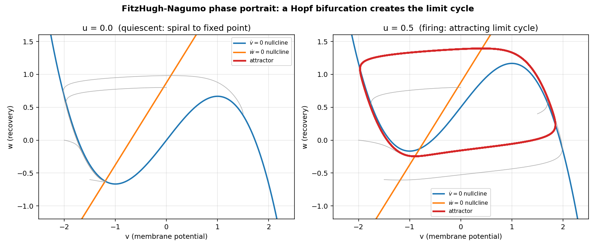
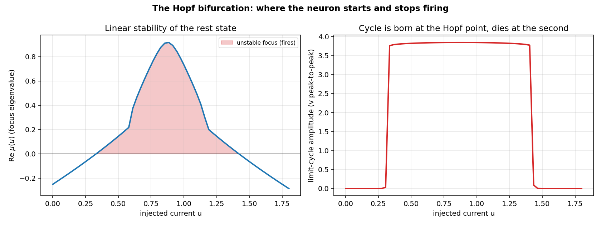
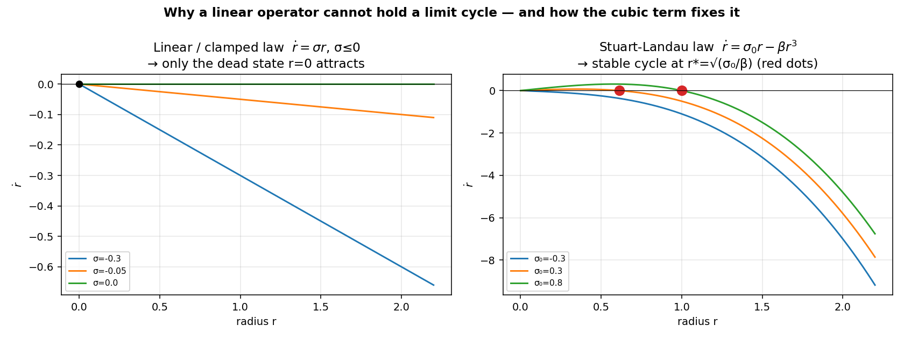
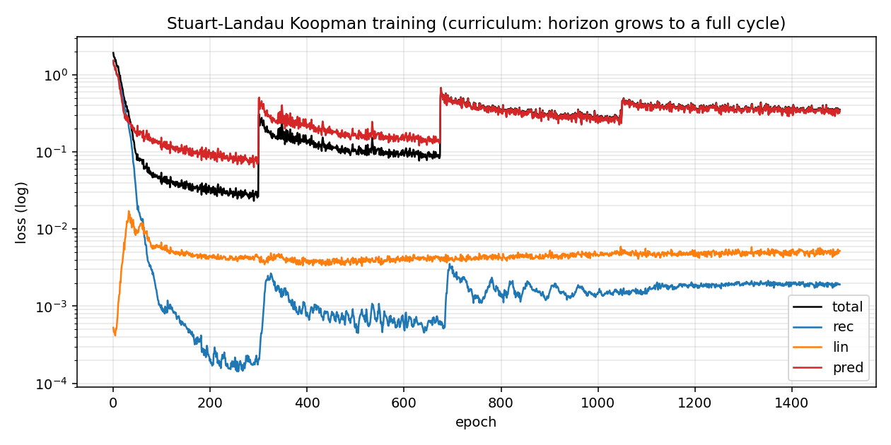
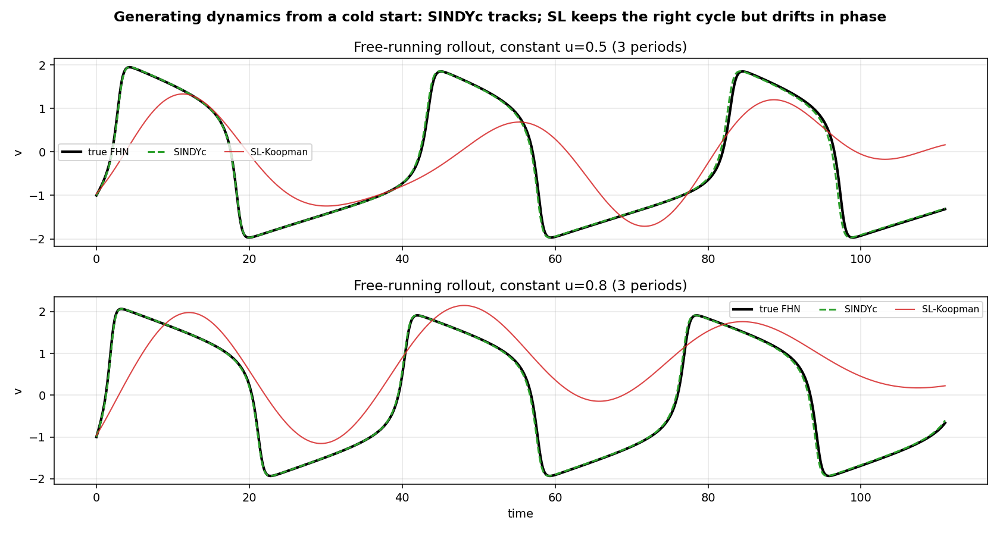
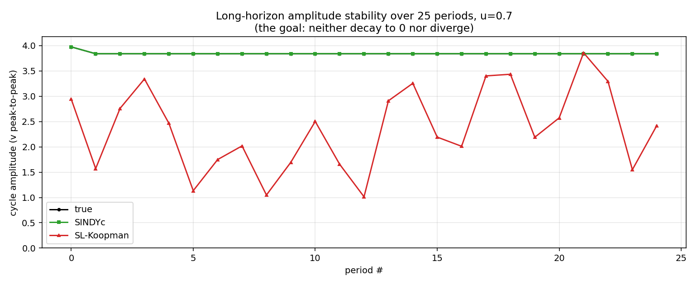
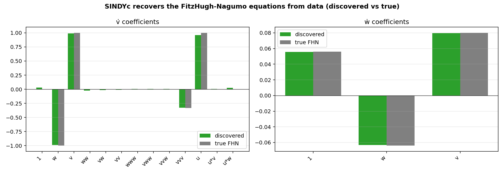
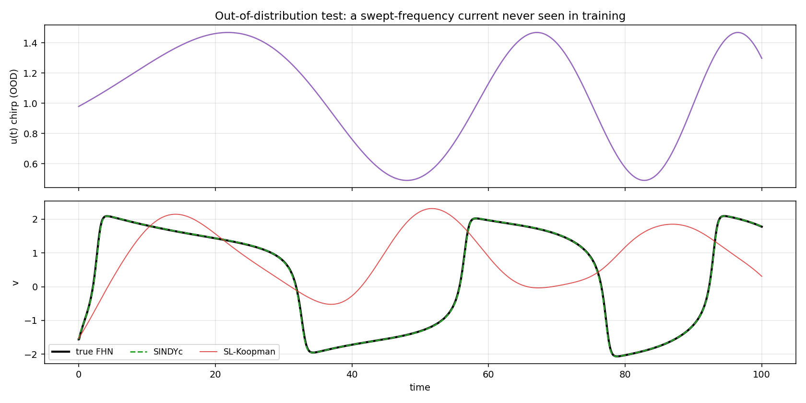
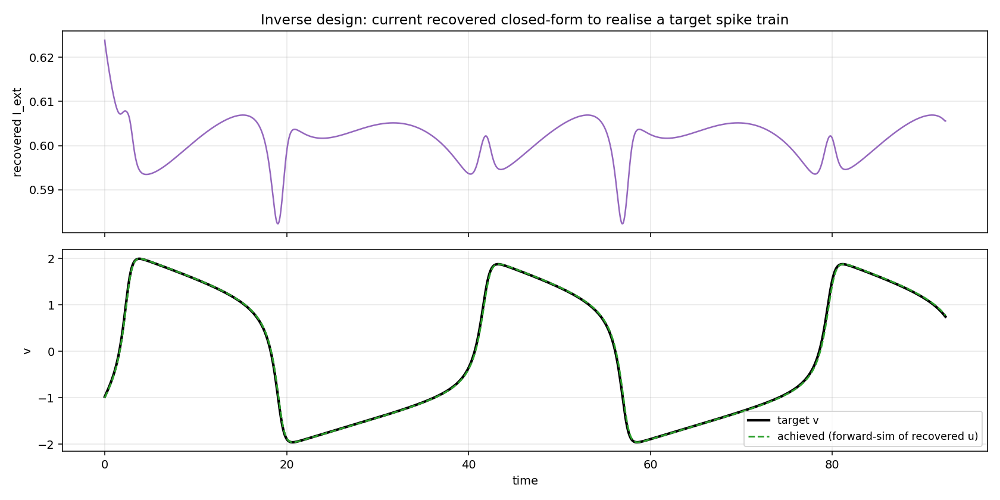

# Learning to Generate Neuron Dynamics — A Beginner's Guide to the Architecture

This guide explains, from first principles, **every** piece of the model we built to
learn the dynamics of a spiking neuron — what the model is, the mathematics behind
it, why the first design failed, how we fixed it, and a second, much cheaper method
that works even better. It assumes only basic calculus and a little linear algebra.
Every claim is backed by a figure generated from the actual trained models
(`plots/article/`).

> **The one-paragraph summary.** We want a model that, given an injected current,
> reproduces a neuron's firing forever without "blowing up" or "fading to zero,"
> generalises to currents it never saw, and can be run *backwards* to compute the
> current needed to steer the neuron. We built two: (1) a **Stuart–Landau Koopman
> network** whose oscillation is stable *by construction*, and (2) **SINDyc**, which
> discovers the neuron's governing equations directly by sparse regression in ~2
> seconds on a laptop CPU. SINDyc wins on accuracy and speed; the Koopman model wins
> on built-in stability guarantees and will matter more for future real-data work.

---

## 0. The goal, in plain words

A neuron's electrical state changes over time according to physical laws. We inject a
**current** `I_ext` and watch the **membrane voltage** `v` respond — often by *firing*:
producing repeated spikes. We want a machine-learning model that:

1. **Generates correct dynamics** for *any* injected current — ones it trained on
   (in-distribution) and ones it didn't (out-of-distribution: different shapes,
   amplitudes).
2. **Stays stable over very long horizons** — the predicted voltage must neither
   **diverge** (run off to infinity) nor **collapse to 0** (the spikes fade away).
   This is the hardest part and was the original failure.
3. **Runs fast** on modest hardware (a 6 GB GPU / a laptop CPU).
4. **Is invertible**: given a *desired* future behaviour 2–3 spike-cycles ahead, solve
   for the current `I_ext` that produces it. This is "intervention" / control design.
5. **Composes** into networks of many neurons later, to study emergent brain-like
   dynamics.

Keep these five requirements in mind — we judge every design against them.

---

## 1. The neuron model: FitzHugh–Nagumo (FHN)

Real neurons (Hodgkin–Huxley) need 4 coupled equations. The **FitzHugh–Nagumo**
model is the famous 2-variable cartoon that keeps the essential behaviour — spiking —
while being simple enough to analyse. Its two state variables are:

- `v` — the **membrane potential** (voltage); the spike is a big swing in `v`.
- `w` — a **recovery variable** (lumps together the slow "reset" currents).

The equations (our parameters `a=0.7, b=0.8, τ=12.5`):

$$
\dot v = v - \tfrac{1}{3}v^3 - w + I_{\text{ext}}, \qquad
\dot w = \frac{1}{\tau}\,(v + a - b\,w).
$$

Read them as "rate of change = …". A few intuitions:

- The cubic term **−v³/3** is the crucial nonlinearity. For large `|v|` it dominates
  and is **negative when v is large positive / positive when v is large negative** —
  i.e. it always pushes `v` back toward zero. This is a *restoring* force that keeps
  the system bounded (remember this — it returns in §7).
- `−w` lets the recovery variable oppose the voltage; `w` rises slowly (divided by the
  large `τ=12.5`), so it lags behind `v`. That lag is what makes the system *oscillate*
  rather than just settle.
- `I_ext` simply **adds to `v̇`**. This is called *control-affine*: the control enters
  linearly and additively. (This single fact makes inversion easy — §7, §9.)

### The phase plane

Because there are two variables, the state is a point `(v, w)` in a plane, and the
dynamics are a flow of arrows in that plane (a *vector field*). Two curves organise
everything — the **nullclines**, where each velocity is zero:

- `v̇ = 0`:  `w = v − v³/3 + I_ext` (a cubic "N" shape),
- `ẇ = 0`:  `w = (v + a)/b` (a straight line).

Where they cross is a **fixed point** (an equilibrium). **Figure 1**
(`fig1_phase_portrait.png`) shows the phase plane for two currents: at `I_ext=0` every
trajectory spirals into the fixed point (the neuron is *quiescent* / silent); at
`I_ext=0.5` the trajectories are sucked onto a **closed loop** (the neuron *fires*
forever). That closed loop is the star of this whole story.



---

## 2. The key phenomenon: a limit cycle born at a Hopf bifurcation

A **limit cycle** is an *isolated, attracting closed orbit*: a loop in the phase plane
that nearby trajectories spiral onto, from **both inside and outside**. That two-sided
attraction is what makes spiking *robust* — knock the neuron off its rhythm and it
returns. A limit cycle is a genuinely **nonlinear** object; this will be the key
difficulty for the model.

How does the cycle appear as we turn up the current? Linearise the dynamics about the
fixed point: the local behaviour is governed by the **Jacobian matrix**

$$
J=\begin{pmatrix} 1-v_*^2 & -1 \\ 1/\tau & -b/\tau \end{pmatrix},
$$

whose two eigenvalues are a complex pair `μ = σ ± iω`. The sign of the **real part σ**
decides stability of the rest state:

- `σ < 0` → the rest state is stable (a damped spiral): **quiescent**.
- `σ > 0` → the rest state is unstable; trajectories spiral *outward* until the cubic
  term catches them on a limit cycle: **firing**.

As `I_ext` increases, `σ(I_ext)` crosses from negative to positive (a limit cycle is
*born*), then later back to negative (the cycle *dies*). Each crossing is a **Hopf
bifurcation**. For our parameters the neuron fires only for `I_ext` roughly in
`[0.33, 1.42]`. **Figure 2** (`fig2_hopf.png`) shows `σ(I_ext)` crossing zero and the
matching birth/death of the cycle amplitude.



**Why you should care for ML:** a correct model must reproduce *all* of this — the
right amplitude, the right frequency, **and** the right place where firing starts and
stops. Getting the Hopf locations wrong means the model spikes when the real neuron is
silent, or vice-versa (we will see this exact failure).

---

## 3. The Koopman idea: make nonlinear dynamics *linear* by lifting

Linear systems (`ż = Kz`) are wonderful: we can solve, analyse, and control them with
pure linear algebra. Nonlinear systems are not. **Koopman theory** offers a trade: find
a (possibly higher-dimensional) change of coordinates in which the nonlinear dynamics
become **linear**.

Concretely we learn three pieces (all small neural nets):

- an **encoder** `z = φ(x)` lifting the 2-D state `x=(v,w)` into a latent vector `z`,
- a **linear operator** `K` (possibly depending on the control) evolving `z` forward,
- a **decoder** `x̂ = ψ(z)` mapping back to physical state.

Train so that *evolving in latent space then decoding* equals *evolving the real
system*: `ψ(K φ(x_t)) ≈ x_{t+1}`. If it works, prediction is just repeated
matrix-vector products — fast and analysable.

Our latent operator is **block-diagonal**: the latent splits into `m` independent 2-D
blocks, each a little **rotation-and-scaling** (a "spiral"):

$$
z_j(t+\Delta t) = e^{\sigma_j \Delta t}\,R(\omega_j \Delta t)\, z_j(t),
$$

where `R` is a 2×2 rotation by angle `ω_j Δt` and `e^{σ_j Δt}` scales the radius. So
`ω_j` is the **frequency** of block `j` and `σ_j` its **growth/decay rate**. Different
blocks can specialise to the spike's fundamental frequency and its harmonics (a sharp
spike = a sum of harmonics, like a Fourier series).

---

## 4. The obstruction: why a *linear* operator cannot hold a limit cycle

Here is the crux — the reason the first design scored **0%**.

A linear system `ż = Kz` can do **exactly three** things, set by the sign of `σ`:

| `σ` | behaviour | picture |
|---|---|---|
| `σ < 0` | radius shrinks → **decays to the origin** | inward spiral |
| `σ > 0` | radius grows → **diverges to infinity** | outward spiral |
| `σ = 0` | radius constant → **neutral orbit** | perfect circle |

A limit cycle needs the radius to be **attracted** to a *nonzero* value from both
sides. None of the three options does that. The `σ=0` "circle" looks tempting, but it
is **marginal, not attracting**: every radius is allowed, so the model has no way to
*pull* the orbit back to the right amplitude. **Figure 3 (left)** shows this —
`ṙ = σ r` only ever has the dead point `r=0` as an attractor when `σ ≤ 0`.



The first version of our model tried to be "safe" by **forcing `σ = −softplus(·) ≤ 0`**
(so rollouts can never blow up). The optimiser, wanting to keep the oscillation alive,
pushed `σ` as close to 0 as it could — but:

1. `σ=0` is never exactly reached, so a tiny residual `σ<0` makes the spike **slowly
   fade to zero** over a long rollout (**violates requirement 2**).
2. With no radial attractor, the amplitude is whatever the encoder happened to output —
   it can't migrate to the correct amplitude for a new current (**violates 1**).

Result: free-running predictions decayed and never locked onto the right cycle —
**0% success**. The "safe" stability clamp was itself the bug.

---

## 5. The fix: the Stuart–Landau (Hopf normal-form) law

The cure is to give the latent radius its *own* nonlinear law — specifically the
**normal form of a Hopf bifurcation**, the exact mathematical archetype of the
phenomenon FHN undergoes (§2). For each block, instead of `ṙ = σ r`, use

$$
\boxed{\;\dot r_j = \sigma_{0,j}(u)\,r_j - \beta_j(u)\,r_j^3\;}\qquad \beta_j>0 .
$$

This is the **Stuart–Landau** equation. The cubic term `−β r³` is the same kind of
restoring nonlinearity as FHN's own `−v³/3`. Let us analyse it (this is the heart of
the architecture).

**Fixed points of the radius.** Set `ṙ = 0`: either `r = 0`, or `r^2 = σ_0/β`, i.e.
`r_* = \sqrt{σ_0/β}` (real only when `σ_0 > 0`).

**Their stability.** The sign of `d\dot r/dr` tells us if a fixed point attracts:

- at `r=0`:  `d\dot r/dr = σ_0`. So the origin is **unstable when `σ_0>0`** — the
  neuron *won't* sit silent; it gets pushed outward.
- at `r=r_*`: `d\dot r/dr = σ_0 - 3β r_*^2 = σ_0 - 3σ_0 = -2σ_0 < 0` when `σ_0>0` — the
  cycle is **stable / attracting**.

So for a firing current (`σ_0>0`) there is a genuinely **attracting limit cycle at
`r_* = \sqrt{σ_0/β}`**, while for a quiescent current (`σ_0<0`) the only attractor is
`r=0` (silence). That is *exactly* FHN's behaviour. **Figure 3 (right)** shows `ṙ(r)`
crossing zero with negative slope at `r_*` — the attractor (red dots).

This single change satisfies four requirements at once:

- **No collapse (req. 2):** for `σ_0>0`, the radius is pulled *up* to `r_*` even from
  near zero — energy is pumped back in. The legacy `σ≤0` law could never do this.
- **No divergence (req. 2):** for large `r`, `−β r³` dominates and `ṙ<0`, so there is a
  global "absorbing ball" — trajectories can't escape. Boundedness is **structural**,
  independent of how well training went.
- **Generalisation (req. 1):** the amplitude `r_*(u)=\sqrt{σ_0(u)/β(u)}` is a *learned
  function of the current*, so the model knows the right amplitude even for currents it
  never saw — and can place the Hopf points by letting `σ_0(u)` change sign.
- **Invertibility (req. 4):** because amplitude is a smooth function of `u`, asking
  "what current gives this amplitude?" is a smooth, low-dimensional solve (§9).

### The exact logistic step (why it is stable for *any* step size)

When we roll the model forward in discrete steps `Δt`, we must integrate the radius
ODE. We do it **exactly**, not with error-prone Euler steps. Let `R = r^2`. Then

$$
\dot R = 2\sigma_0 R - 2\beta R^2,
$$

which is the **logistic equation** — and it has a closed-form solution. Over one step,

$$
R(t+\Delta t) = \frac{\sigma_0\,R\,e^{2\sigma_0\Delta t}}
{\sigma_0 + \beta R\,(e^{2\sigma_0\Delta t}-1)}
\qquad\text{(and the limit }R/(1+2\beta R\,\Delta t)\text{ as }\sigma_0\to 0).
$$

Because this is the *exact* flow, the rollout is **unconditionally bounded** — it
cannot overshoot or blow up regardless of `Δt` or how many steps you take. We verified
this formula against a fine numerical integration to better than `10⁻⁵` relative error
across all regimes. The angle simply advances by `ω_j Δt`. (Code:
`model.py::_sl_radius_step`, `spiral_sl_coeffs`.)

### Training the Stuart–Landau model

We minimise three losses (all in `model.py::compute_losses`):

1. **Reconstruction** `‖x − ψ(φ(x))‖` — the encoder/decoder must be faithful.
2. **Latent linearity** `‖φ(x_{t+1}) − Kφ(x_t)‖` — one step in latent space must match.
3. **Multi-step prediction** — decode a *rollout* of many latent steps and compare to
   the truth. This is what teaches the model to *sustain* the cycle.

Two practical points that matter on weak hardware:

- **Curriculum:** the prediction horizon starts short (80 steps) and grows to a **full
  spike period** (~780 steps). The original code stopped at 200 steps ≈ ¼ period, far
  too short to learn sustaining. (The neuron's period is ~37 time units = 740 steps at
  `Δt=0.05`.)
- **Gradient checkpointing:** back-propagating through a 740-step rollout would store
  740× the activations and overflow a 6 GB GPU. We *recompute* each step during the
  backward pass instead of storing it (`jax.checkpoint`), and process prediction
  windows one at a time (`lax.map`). This is what makes full-cycle training fit in
  memory. Training took ~32 min. **Figure 4** shows the loss curves.



### What the Stuart–Landau model achieves (and where it falls short)

- ✅ **Stability solved.** Over **25 periods** (18,500 steps) the free-running rollout
  stays finite and every firing current sustains its cycle (amplitude ratio
  last/first ≈ 0.83–1.09). **No divergence, no collapse** — the original goal.
- ✅ **Right frequency.** In-distribution, the *spectral* success (dominant frequency
  and amplitude within tolerance) is **100%**.
- ⚠️ **Phase drift.** Pointwise accuracy over 2 periods is poor (NRMSE ≈ 0.8): the
  model oscillates at the right rate but its phase slowly slides relative to the truth,
  so a point-by-point comparison fails even though the *dynamics* are right.
- ⚠️ **Amplitude undershoot & spurious firing.** A few sinusoidal modes through a
  *linear* decoder struggle to reproduce FHN's sharp relaxation spike, so amplitude
  comes out ~2.5 vs the true ~3.8; and `σ_0(u)` doesn't go negative sharply enough at
  the Hopf points, so it spikes a little in bands that should be silent.

**Figures 5 and 6** show this: the right cycle shape and rate, sustained for many
periods, but offset in phase and amplitude.





These shortcomings motivated a completely different, far cheaper approach.

---

## 6. A faster route: SINDyc — *discover the equations* directly

The Stuart–Landau model *imitates* the dynamics with a black-box network. **SINDyc**
(Sparse Identification of Nonlinear Dynamics with control) instead **discovers the
governing equations themselves** by regression. The insight: FHN is *literally* a
low-order polynomial ODE, so if we guess a library of candidate terms and ask "which
combination explains the measured derivatives?", we recover the true equations.

### The method, step by step

1. **Estimate derivatives from data.** From a trajectory `x(t)` compute `ẋ(t)` by
   finite differences (we use a 4th-order stencil). No model needed — just data.
2. **Build a feature library** `Θ(v,w,u)` — a menu of candidate terms:
   $$\Theta = [\,1,\ v,\ w,\ v^2,\ vw,\ w^2,\ v^3,\ \dots,\ u,\ uv,\ uw\,].$$
   We include polynomials up to degree 3 and the control `u` (and `u·v, u·w` in case
   the control coupling is state-dependent).
3. **Solve a sparse regression** `\dot X \approx \Theta\, \Xi`. We want `Ξ` (the
   coefficients) to be **sparse** — most candidate terms should be exactly zero,
   because real physics is parsimonious. We use **STLSQ** (sequentially-thresholded
   least squares): do a least-squares fit, zero out any coefficient below a threshold,
   refit on the survivors, repeat. (A subtlety: we normalise the library columns first
   so that genuinely small coefficients — like FHN's `1/τ ≈ 0.08` terms — aren't
   wrongly deleted. Code: `sindyc.py::stlsq`.)

### What it found

In **2.3 seconds on a CPU** (vs 32 minutes on the GPU for the Koopman model), SINDyc
recovered:

```
v̇  =  +0.988·v  −0.328·v³  −0.991·w  +0.962·u     (+ tiny spurious terms ~0.02)
ẇ  =  +0.0555   +0.0797·v  −0.0633·w
```

Compare to the truth `v̇ = v − 0.333·v³ − w + u`, `ẇ = (v + 0.7 − 0.8w)/12.5 = 0.056 +
0.08v − 0.064w`. **Essentially exact.** **Figure 7** plots discovered vs true
coefficients.



### Why this is so good against our five requirements

- **Limit cycle (req. 1):** it learns the *true nonlinear vector field*, so it is **not
  subject to the linear-operator obstruction** of §4 — the recovered cubic genuinely
  has a Hopf bifurcation and a self-correcting attracting cycle, with the correct
  amplitude, period, *and* Hopf locations. Out-of-distribution (a swept-frequency
  "chirp" current never trained on): **100% success**, mean NRMSE **0.018**
  (the Koopman model got 0% pointwise here). **Figure 8.**
- **Stability (req. 2):** boundedness is inherited from the recovered **negative cubic
  `−v³/3`** (the field points inward at large `|v|`). We *verify* this after fitting —
  check the `v³` coefficient is negative and run a 200-period rollout — because, unlike
  Stuart–Landau, SINDyc has no *built-in* guarantee. It passed: finite over 200
  periods, correct amplitude in the firing band, correctly silent outside it.
- **Speed (req. 3):** one sparse linear solve. ~2 s on a laptop CPU, no GPU.
- **Invertibility (req. 4):** because the control is an **affine column** of the
  library, one-step inversion is **closed-form** (§9). Recovered-vs-true current error
  was **0.006**.



---

## 7. Head-to-head: which model, when?

| | **Stuart–Landau Koopman** | **SINDyc** |
|---|---|---|
| Training | ~32 min, GPU, BPTT | **~2 s, CPU**, one regression |
| Long-horizon boundedness | **guaranteed by construction** (β>0, exact logistic) | inherited from `−v³` (must verify) |
| Non-collapse | needs `σ₀(u)>0` (training-dependent) | structural, correct Hopf points |
| Limit-cycle fidelity | right rate, drifts in phase; amplitude undershoot | **near-exact waveform** |
| OOD success (chirp, pointwise) | 0% | **100%** |
| Inversion | gradient through rollout | **closed-form 1-step** |
| Best for | partial-observation / unknown-basis / *certified* stability | known-ish physics, speed, accuracy |

**Recommendation (and what we shipped):** use **SINDyc as the primary generator** —
it dominates on speed, accuracy, generalisation and inversion for this problem. Keep
the **Stuart–Landau Koopman** as the *structural-guarantee* model: its boundedness
holds for *any* horizon and step size regardless of fit quality, and it degrades more
gracefully when only `v` is observed (real recordings rarely give you `w`) because the
encoder can build the missing coordinate. A natural **hybrid** for the future: use the
SINDyc-discovered field to *warm-start* the Koopman model's `σ₀(u), β, ω(u)` so it is
both bounded-by-construction *and* trained in seconds.

> **Why not a plain linear/bilinear Koopman (DMDc)?** It is the cheapest of all and the
> *best* for convex multi-step inversion, but — per §4 — a linear operator at fixed
> input **cannot host an attracting limit cycle**. Use it only as an inversion *layer*
> on top of a nonlinear attractor core, never as the standalone generator. (We also
> surveyed reservoir computing, contraction metrics, and phase-reduction autoencoders;
> see the references.)

---

## 8. Inverse design / intervention

Now the payoff (req. 4). FHN is control-affine: `ẋ = f(x) + g(x)\,u`. For SINDyc both
`f` and `g` are read straight off the discovered coefficients, so to make the voltage
follow a *desired* rate `\dot v_{\text{des}}` we just **solve for `u`**:

$$
\boxed{\,u = \dfrac{\dot v_{\text{des}} - f_v(v,w)}{g_v(v,w)}\,}
$$

— a **closed-form**, per-step expression (`sindyc.py::invert_onestep`). To hit a target
state several cycles ahead, we roll this out (a small, cheap nonlinear shooting
problem) with the current **box-constrained** to physically realistic values.
**Figure 9** shows a target spike train and the current our model recovered to realise
it, then a forward simulation confirming the target is hit.



For the Stuart–Landau model, inversion is done by gradient descent through the
differentiable rollout (`intervention.py`) — still fast (the model is tiny and
GPU-resident) and useful when you want amplitude/phase targets rather than exact
waveforms.

---

## 9. Speed (for real-time intervention)

Measured on this machine (6 GB GPU):

- **Stuart–Landau Koopman — prediction:** rolling out **64 neurons for 1500 steps
  (≈ 2 spike cycles) takes 77 ms** on the GPU. Plenty fast for predicting "2–3 cycles
  ahead."
- **Stuart–Landau Koopman — inversion:** gradient descent (400 iterations) through the
  full 1500-step rollout took **~100 s** and only reached NRMSE ≈ 0.71 — its phase
  drift makes the control problem ill-conditioned. Usable for amplitude targets, weak
  for exact-waveform control.
- **SINDyc — prediction:** a 2-state RK4 rollout for 2–3 cycles is
  microseconds–milliseconds on CPU.
- **SINDyc — inversion:** **closed-form, one division per step** — effectively
  instantaneous, with recovered-current error **0.006**.

For the intervention requirement (req. 4), SINDyc's closed-form inverse is the clear
choice; the Koopman model is the fast *forward* predictor and the structural-stability
fallback.

---

## 10. Glossary

- **State `(v,w)`** — the neuron's instantaneous condition (voltage + recovery).
- **Vector field** — the arrow at each state telling it where to go next (`ẋ`).
- **Fixed point** — a state where `ẋ=0`; the system can rest there.
- **Limit cycle** — an isolated closed orbit that attracts nearby trajectories; this is
  "spiking forever."
- **Hopf bifurcation** — the parameter value where a stable rest state turns unstable
  and gives birth to a limit cycle (here, the current at which firing starts/stops).
- **Jacobian / eigenvalues `σ ± iω`** — the local linearisation; `σ` = growth rate,
  `ω` = oscillation frequency.
- **Koopman operator** — a linear operator that advances *observables* of a nonlinear
  system; the basis for "lift to a space where dynamics are linear."
- **Stuart–Landau / Hopf normal form** — the canonical equation `ṙ = σ₀r − βr³` whose
  attracting cycle we used to fix the model.
- **Absorbing ball** — a region trajectories can enter but not leave; guarantees
  boundedness.
- **BPTT** — back-propagation through time; training by differentiating a long rollout.
- **Gradient checkpointing** — recomputing forward activations during the backward pass
  to save memory.
- **SINDy / SINDyc** — sparse regression that discovers governing equations (with
  control) from data.
- **STLSQ** — sequentially-thresholded least squares; the sparse solver inside SINDy.
- **Control-affine** — the control enters the dynamics linearly (`ẋ = f(x)+g(x)u`),
  which makes inversion easy.
- **NRMSE** — normalised root-mean-square error; our accuracy metric.

## 11. Where things live in the code

| concept | file |
|---|---|
| FHN equations & currents | `dynamics.py`, `data_gen.py` |
| true Jacobian spectrum / Hopf | `fhn_theory.py` |
| Stuart–Landau Koopman model | `model.py` (`spiral_sl_coeffs`, `_sl_radius_step`) |
| training (curriculum, checkpointing) | `train.py` |
| long-horizon stability check | `stability_eval.py` |
| **SINDyc** discovery + inversion | `sindyc.py`, `fit_sindyc.py` |
| inverse design / control | `intervention.py` |
| these figures | `make_article_figures.py` |
| diagnostics (spectrum, Floquet, success) | `diagnostics.py` |

## 12. References (for going deeper)

- Brunton, Proctor, Kutz — *SINDYc: Sparse Identification of Nonlinear Dynamics with
  Control*, arXiv:1605.06682.
- Kaiser, Kutz, Brunton — *SINDY-MPC (control in the low-data limit)*, arXiv:1711.05501.
- Lusch, Kutz, Brunton — *Deep learning for universal linear embeddings of nonlinear
  dynamics*, Nature Comms 2018 / arXiv:1712.09707 (parametric Koopman eigenvalues).
- Brunton et al. — *Koopman invariant subspaces… for control*, arXiv:1510.03007 (why a
  finite linear model cannot host a limit cycle).
- Kuznetsov — *Andronov–Hopf bifurcation*, Scholarpedia (the `r=√μ` attracting cycle).
- Kaptanoglu et al. — *Promoting global stability in data-driven models*,
  arXiv:2105.01843 (stability caveats of SINDy).
- Manchester & Slotine — *Transverse contraction criteria for limit cycles*,
  arXiv:1209.4433 (certified orbital stability, for future network work).
